<h2>Certify Technology Makine Öğrenimi Stajı — Projeler</h2>

  Bu depo, staj kapsamındaki görevlerin çalıştırılabilir çözümlerini ve çıktılarının üretilmesini sağlar.
  Ana çalışma dosyası <code>Compulsory_Internship_Tasks.ipynb</code> olup veriler <code>data/</code> klasöründe yer alır.
  Aşağıdaki tüm içerik HTML olarak yazılmıştır.
   
  Not: README dosyaları GitHub ve çoğu platformda HTML'yi destekler.
  Markdown ile birlikte HTML kullanımı yaygındır.
  Bu dosyada yalnızca HTML kullanılmıştır.
  

<h3>Gereksinimler</h3>
<ul>
  <li>Python 3.9+ (öneri: 3.10 veya üzeri)</li>
  <li>Jupyter Notebook ya da VS Code (Jupyter eklentisiyle)</li>
  <li>Temel kütüphaneler: <code>pandas</code>, <code>numpy</code>, <code>scikit-learn</code>, <code>matplotlib</code>, <code>seaborn</code></li>
</ul>

<h3>Nasıl Çalıştırılır</h3>
<ol>
  <li><code>Compulsory_Internship_Tasks.ipynb</code> dosyasını Jupyter veya VS Code ile açın.</li>
  <li>Hücreleri sırayla çalıştırın. Gerekli veri dosyaları <code>data/</code> altında hazırdır.</li>
  <li>Eğitim/Değerlendirme metrikleri hücre çıktılarında görünür; grafikler notebook içinde görüntülenir.</li>
</ol>

<h3>İçerik</h3>

<h4>Seviye 1 — Kodlama Alıştırmaları</h4>
<ul>
  <li>Doğrusal Regresyon (California Housing): MSE ve R²; Gerçek vs Tahmin saçılım grafiği.</li>
  <li>Karar Ağacı (Iris): doğruluk, karışıklık matrisi ve ağaç görselleştirmesi.</li>
</ul>

<h4>Seviye 1 — Zorunlu: Spam E-posta Sınıflandırma</h4>
<ul>
  <li>Yaklaşım: TF‑IDF + MultinomialNB (Naive Bayes)</li>
  <li>Metrikler: doğruluk, precision, recall, F1</li>
</ul>

<h4>Seviye 2 — Sigorta Ücreti Tahmini</h4>
<ul>
  <li>Modeller: Linear Regression, RandomForest, (isteğe bağlı) XGBoost</li>
  <li>Metrikler: MSE, R²</li>
  <li>Görselleştirmeler: korelasyon ısı haritası, Gerçek vs Tahmin, özellik önemleri</li>
</ul>

<h4>Seviye 2 — Perakende Müşteri Bölümleme (K‑Means)</h4>
<ul>
  <li>Yöntem: Dirsek yöntemi ile k belirleme, ardından K‑Means; PCA ile 2B küme görselleştirme</li>
</ul>

<h4>Seviye 3 — Kredi Kartı Sahtecilik Tespiti</h4>
<ul>
  <li>Modeller: Lojistik Regresyon, RandomForest (uygun ölçekleme/dengeleme ile)</li>
  <li>Metrikler: ROC‑AUC, PR‑AUC</li>
  <li>Görselleştirmeler: ROC ve Precision‑Recall eğrileri</li>
</ul>

<h3>Notlar</h3>
<ul>
  <li>Veri setleri <code>data/</code> altında bulunduğu için çevrimdışı çalışma mümkündür.</li>
  <li>Grafik ve ara çıktılar her yeniden çalıştırmada tekrar üretilebilir.</li>
</ul>

<h3>Çıktı Görselleri (photos/)</h3>

  <figure style="margin:0; text-align:center;">
    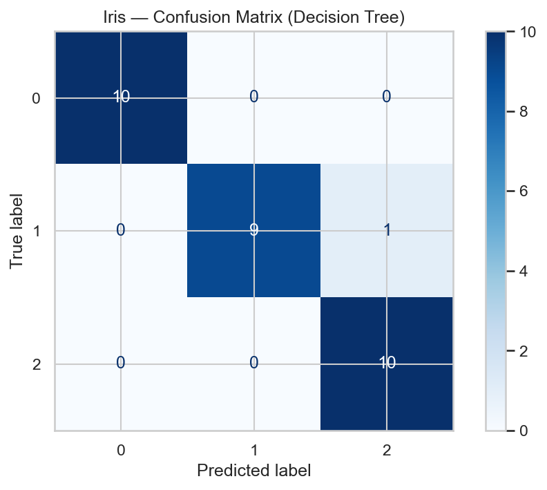
    <figcaption style="margin-top:8px; color:#666;">Iris - Karışıklık Matrisi</figcaption>
  </figure>
  <figure style="margin:0; text-align:center;">
    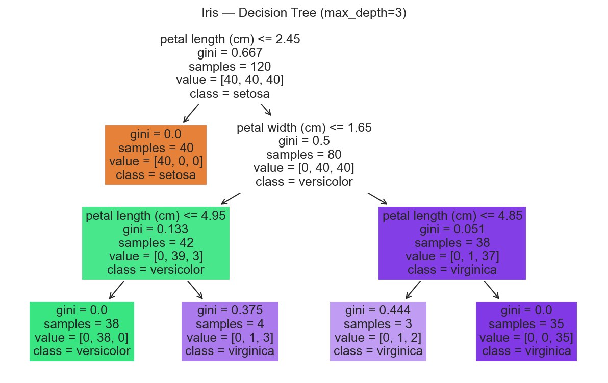
    <figcaption style="margin-top:8px; color:#666;">Iris - Karar Ağacı</figcaption>
  </figure>
  <figure style="margin:0; text-align:center;">
    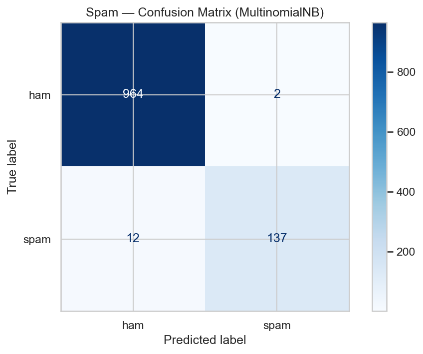
    <figcaption style="margin-top:8px; color:#666;">Spam - Karışıklık Matrisi</figcaption>
  </figure>
  <figure style="margin:0; text-align:center;">
    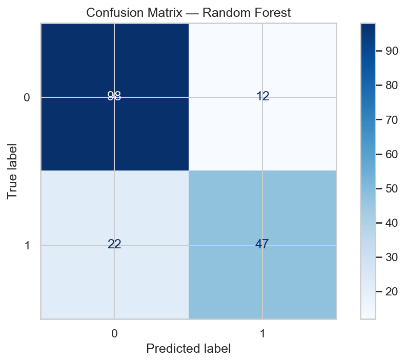
    <figcaption style="margin-top:8px; color:#666;">Titanic - Karışıklık Matrisi</figcaption>
  </figure>
  <figure style="margin:0; text-align:center;">
    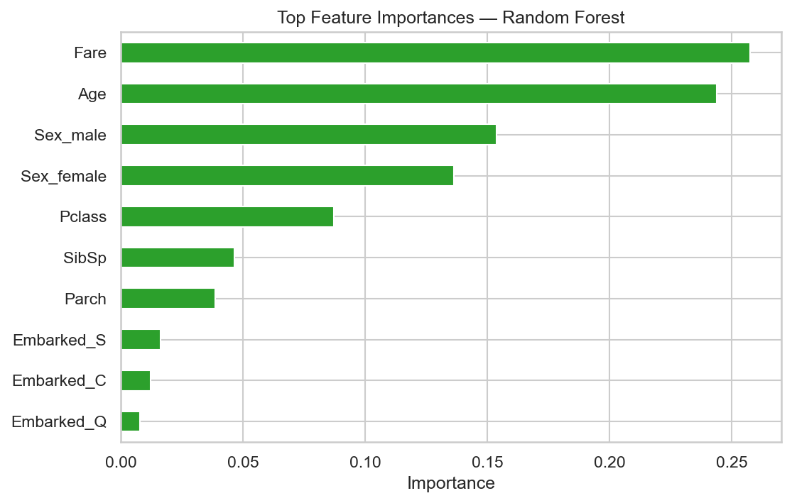
    <figcaption style="margin-top:8px; color:#666;">Titanic - Özellik Önemleri</figcaption>
  </figure>
  <figure style="margin:0; text-align:center;">
    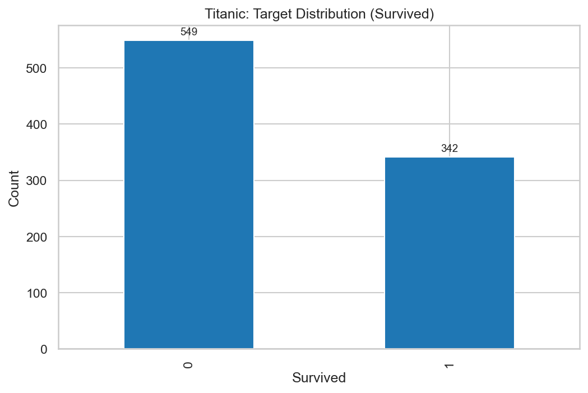
    <figcaption style="margin-top:8px; color:#666;">Titanic - Hedef Dağılımı</figcaption>
  </figure>
  <figure style="margin:0; text-align:center;">
    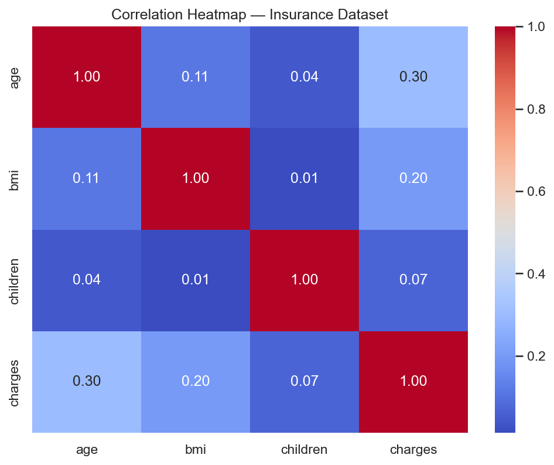
    <figcaption style="margin-top:8px; color:#666;">Sigorta - Korelasyon Isı Haritası</figcaption>
  </figure>
  <figure style="margin:0; text-align:center;">
    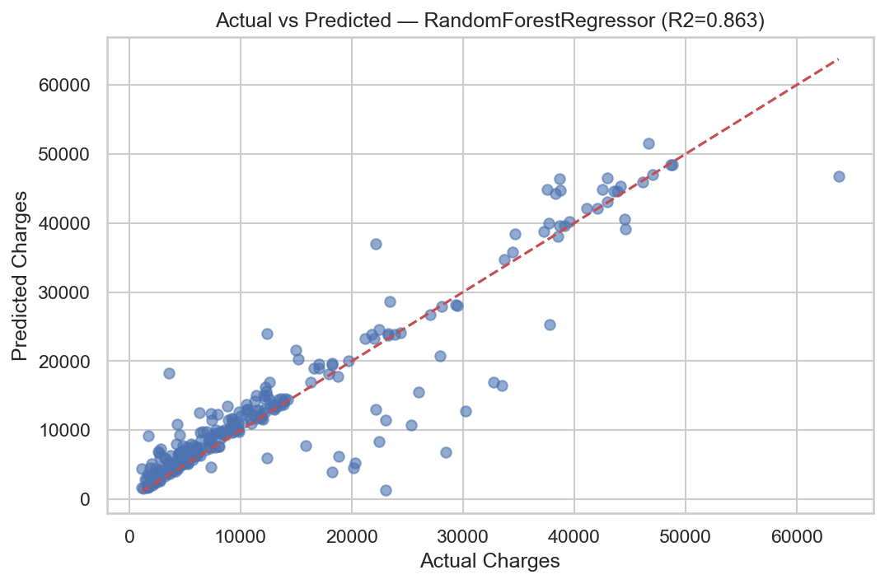
    <figcaption style="margin-top:8px; color:#666;">Sigorta - Gerçek vs Tahmin (RandomForest)</figcaption>
  </figure>
  <figure style="margin:0; text-align:center;">
    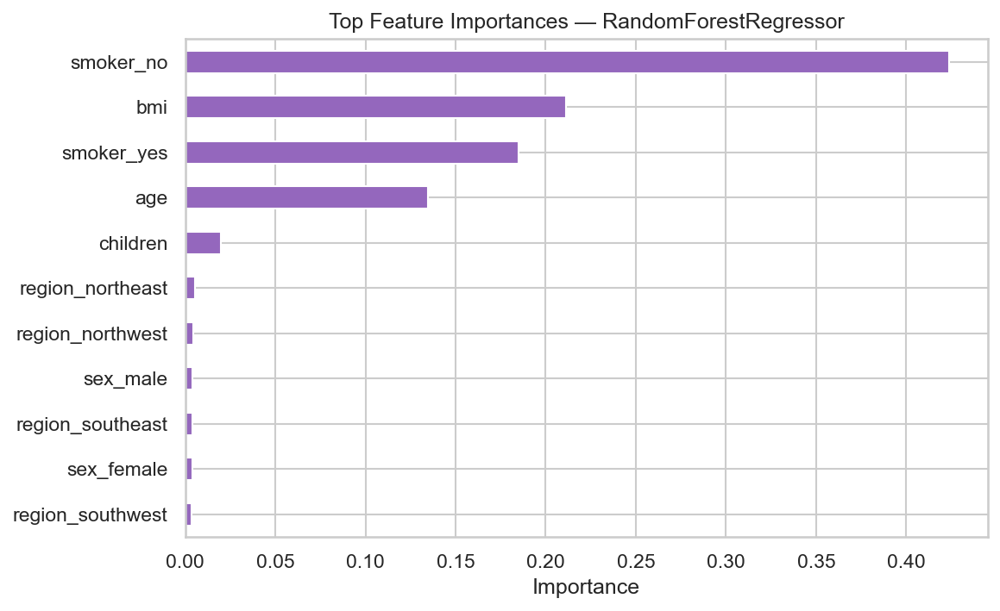
    <figcaption style="margin-top:8px; color:#666;">Sigorta - Özellik Önemleri (RandomForest)</figcaption>
  </figure>
  <figure style="margin:0; text-align:center;">
    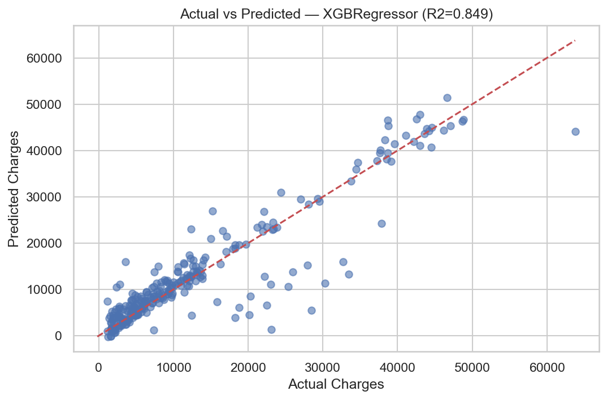
    <figcaption style="margin-top:8px; color:#666;">Sigorta - Gerçek vs Tahmin (XGBRegressor)</figcaption>
  </figure>
  <figure style="margin:0; text-align:center;">
    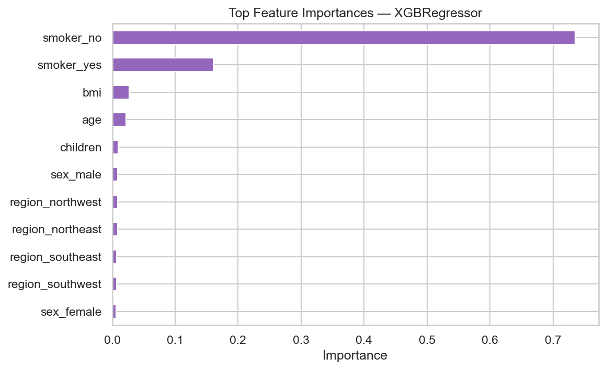
    <figcaption style="margin-top:8px; color:#666;">Sigorta - Özellik Önemleri (XGBRegressor)</figcaption>
  </figure>
  <figure style="margin:0; text-align:center;">
    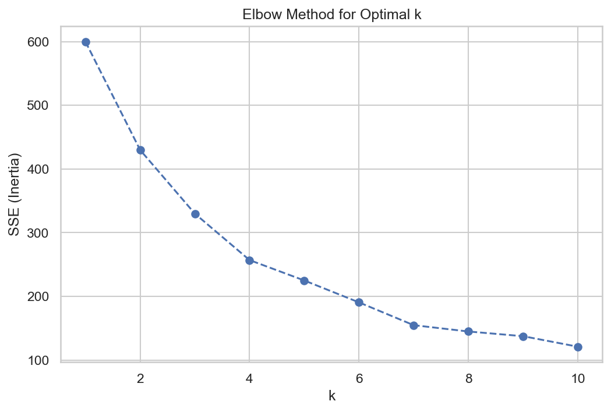
    <figcaption style="margin-top:8px; color:#666;">Perakende Bölümleme - Dirsek Yöntemi</figcaption>
  </figure>
  <figure style="margin:0; text-align:center;">
    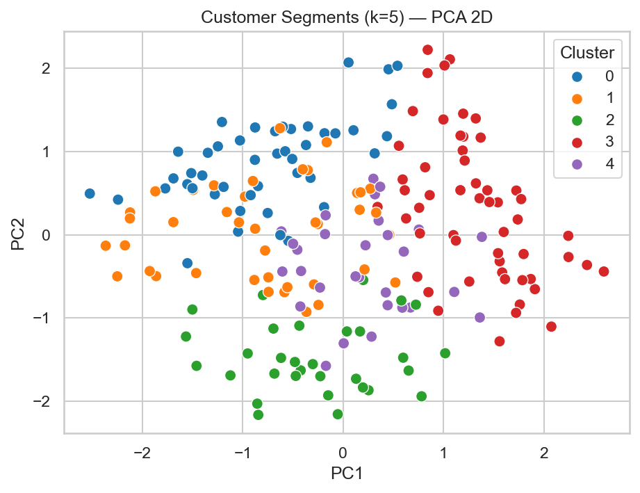
    <figcaption style="margin-top:8px; color:#666;">Perakende Bölümleme - PCA Küme Görselleştirme</figcaption>
  </figure>
  <figure style="margin:0; text-align:center;">
    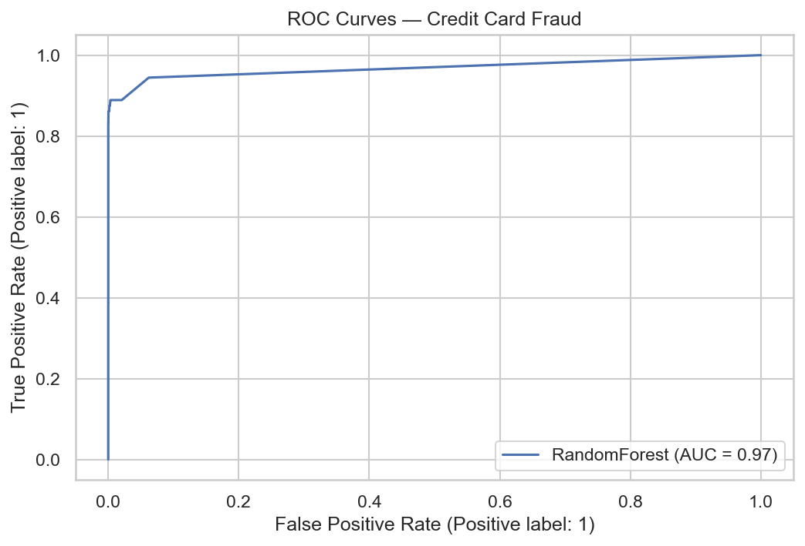
    <figcaption style="margin-top:8px; color:#666;">Kredi Kartı Sahtecilik - ROC Eğrileri</figcaption>
  </figure>
  <figure style="margin:0; text-align:center;">
    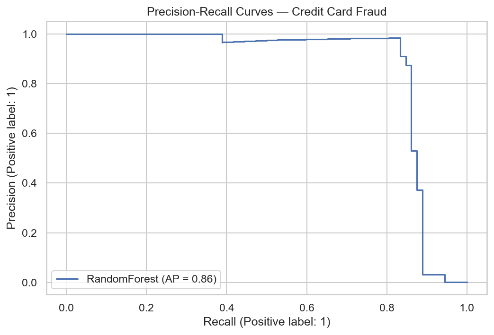
    <figcaption style="margin-top:8px; color:#666;">Kredi Kartı Sahtecilik - Precision-Recall Eğrileri</figcaption>
  </figure>

